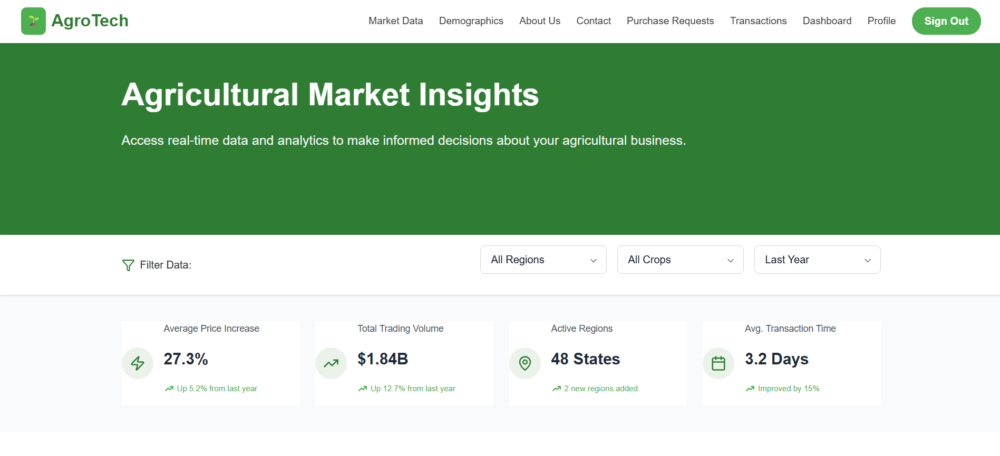
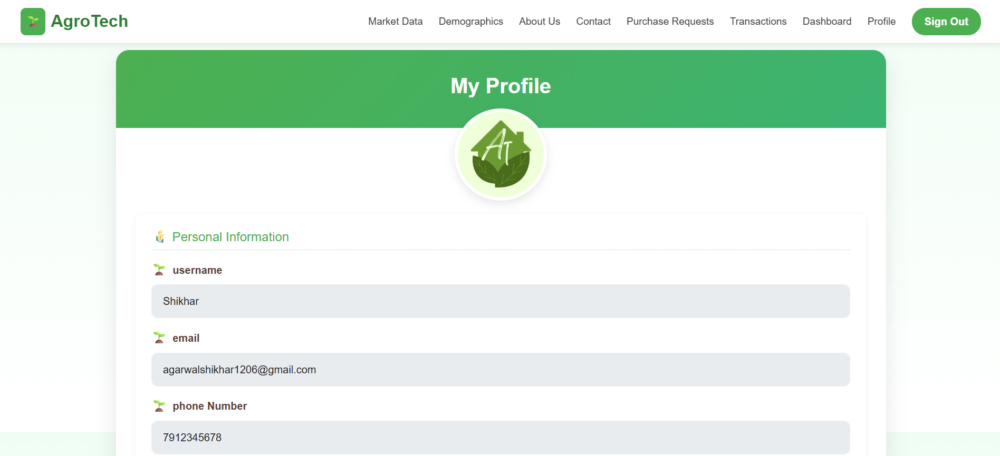
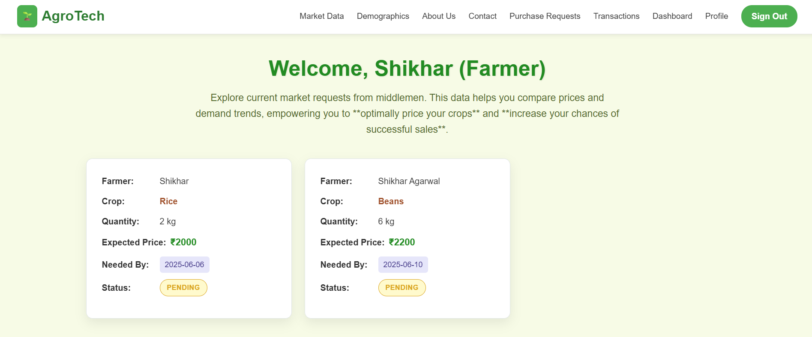
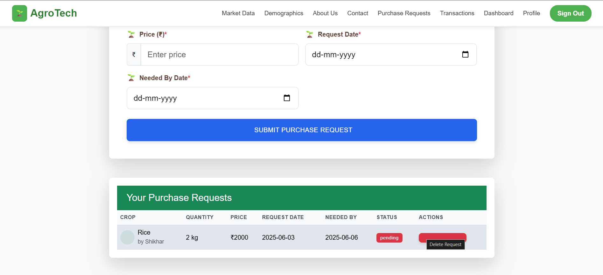

                                                      🌾 AgroTech – The Coding Crew 🌾
🚜 Empowering Farmers Through Fair Trade 🚜
AgroTech is a web platform designed to connect farmers directly with middlemen to enable transparent, fair, and localized crop pricing.
By eliminating unnecessary intermediaries, AgroTech ensures that both farmers and buyers can negotiate, interact, and transact seamlessly, fostering better profits and trust-based trade relationships. 🤝

🚀 Features

✔️ 👤 User Authentication – Secure registration and login for farmers and middlemen.

✔️ 🌾 Crop Listing – Farmers can upload and list crops with detailed information.

✔️ 💬 Direct Interaction – Middlemen can view, contact, and negotiate directly.

✔️ 🖼️ Profile Photo Upload – Personalized user profiles with image support.

✔️ 🔐 Secure Backend – REST APIs powered by Spring Boot for reliable operations.

✔️ ⚡ Responsive Frontend – Clean, mobile-friendly UI built with React.js.

🛠️ Tech Stack

🎨 Frontend -> 	React.js

🚀 Backend -> Spring Boot (Java)

🗄️ Database -> 	MySQL

🛠️ Build Tools ->	Maven, npm

🔐 Authentication -> 	Spring Security

📸 UI Screens

